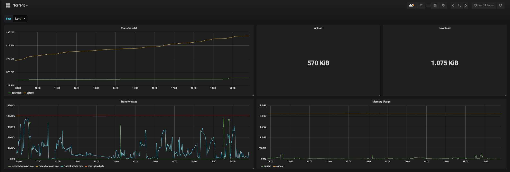

# telegraf

This bundle will install [telegraf](https://www.influxdata.com/time-series-platform/telegraf/) as part of the TICK stack.

A manual setup of influxdb may be required beforehands.
Please find the details inside the influxdb bundle.

## Requirements

* Bundles:
  * [dnf](https://github.com/rullmann/bundlewrap-dnf)
  * [influxdb](https://github.com/rullmann/bundlewrap-influxdb)

## Setup notes

Apply this bundle on one node as a start if the telegraf influxdb database hasn't been created yet.

## Integrations

* Bundles:
  * [nginx](https://github.com/rullmann/bundlewrap-nginx)
  * [php](https://github.com/rullmann/bundlewrap-php)
  * [chrony](https://github.com/rullmann/bundlewrap-chrony)
  * [collectd-minimal](https://github.com/rullmann/bundlewrap-collectd-minimal)
    * in order to receive collectd data
  * [haproxy](https://github.com/rullmann/bundlewrap-haproxy)
    * Please read the notes regarding integration inside the haproxy bundle!
  * [hddtemp](https://github.com/rullmann/bundlewrap-hddtemp)
  * [influxdb](https://github.com/rullmann/bundlewrap-influxdb)
  * [kapacitor](https://github.com/rullmann/bundlewrap-kapacitor)
  * [lm-sensors](https://github.com/rullmann/bundlewrap-lm-sensors)
  * [smartmontools](https://github.com/rullmann/bundlewrap-smartmontools)
  * [postgresql](https://github.com/rullmann/bundlewrap-postgresql)
    * requires a role named `telegraf`
  * [atlassian-confluence](https://github.com/rullmann/bundlewrap-atlassian-confluence)
  * [atlassian-bitbucket](https://github.com/rullmann/bundlewrap-atlassian-bitbucket)
  * [atlassian-bamboo](https://github.com/rullmann/bundlewrap-atlassian-bamboo)
  * [xmr-stak](https://github.com/rullmann/bundlewrap-xmr-stak)
    * Defaults to http port 8080. http service must be enabled but can be configured in the xmr-stak bundle

* Generic:
  * Java VM
  * Tomcat
  * [rtorrent](https://github.com/rakshasa/rtorrent)

## Metadata

    'metadata': {
        'telegraf': {
            'influxdb_url': 'http://127.0.0.1:8086', # optional
            'username': 'telegraf', # optional, influxdb user
            'password': 'mysupersecretpassword', # required, password for influxdb user
            'collect_cpu', True, # optional
            'collect_disk', True, # optional
            'collect_kernel', True, # optional
            'collect_mem', True, # optional
            'collect_swap', False, # optional
            'collect_system', True, # optional
            'collect_interrups', True, # optional
            'collect_vmstat', True, # optional
            'collect_sysctl_fs', True, # optional
			'collect_java': False, # optional
            'collect_tomcat' False, # optional
            'jolokia_url': 'http://127.0.0.1:8090/jolokia', # optional, for usage with atlassian bundle integration as well as `collectd_java` or `collect_tomcat`
            'haproxy': { # optional
                'stats_url': 'http://127.0.0.1:11111/stats',
            },
            'collectd_input': {
                'ip': '127.0.0.1', # required, on which ip to listen for incoming collectd statistics
                'username': 'someuser', # required, the servers username for incoming connections
                'password': 'supersecretpw', # required, the servers password for incoming connections
            },
            'custom_configs': { # optional, add custom configs detailed below
                'someconfig',
            },
            'binary_install': False, # optional, installs telegraf armhf binary (e.g. for Raspberry Pi 3)
            'synology': { # optional, enable synology nas monitoring with snmp
                'agents': ['mynas'], # ip addresses or hostnames of your synology nas devices
            },
            'rtorrent': { # optional, to enable rtorrent monitoring
                'url': 'https://localhost/RPC', # make sure this url is accessible by your telegraf node without authentication
            },
        },
    }

### collectd Input

Enabling this option and setting the metadata will create an additional config and open firewalld to accept these connections.
In combination with the [collectd-minimal](https://github.com/rullmann/bundlewrap-collectd-minimal) bundle this allows you to retrieve and store data for special services from collectd.

### Binary Install form armhf

InfluxData provides repositories for various distributions, but only limited support for architectures. Therefore on some systems like armhf architecture a binary install is required.
Enabling this option will not use `pkg_dnf` items. Instead it will deploy an install script and perform other necessary steps to get telegraf up and running.
Simply set `binary_install` to `True` to use this option.

### Synology monitoring

Monitor your Synology NAS with this option. The config is available on [Github by jperrilo](https://github.com/jperillo/Synology_dashboard_grafana).
A Grafana dashboard can be found [here](https://grafana.com/dashboards/1727).

### rtorrent monitoring

Enabling the option as described above will monitor your rtorrent instance. RPC must be available without a password.
You can then use [this dashboard](extras/rtorrent_simple.json) in your Grafana to visualize the data.

Which will give you a dashboard like this:

### Custom Configurations

This bundle allows you to add custom telegraf configuration files. This may be useful if you want to monitor a webservice or grab data from other api not related to any of your bundles.
Simply create the directory `data/telegraf/files/` within your bundlewrap repo and put the config file in the format `${node.name}.friendlyname` in there.
For example our node name is `foo` and our config name is `bar`: `data/telegraf/files/foo.bar`
This would result in the creation of the file `/etc/telegraf/telegraf.d/bar.conf` on node `foo`.
